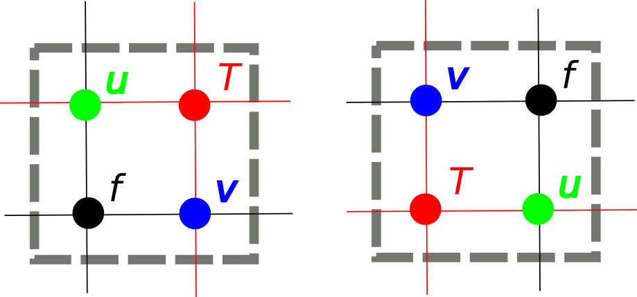

.. highlight:: fortran

Introduction
++++++++++++

The dl_esm_inf (for Daresbury Laboratory Earth-System Modelling
Infrastructure) library provides basic support for finite-difference
earth-system-type models written in Fortran. It currently
supports two-dimensional, finite-difference models.

The first version of this library was developed to support 2D finite-
difference shallow-water models in the GOcean Project.

.. _gocean1.0-grid:

Grid
++++

The dl_esm_inf library contains a ``grid_mod`` module which defines a
``grid_type`` and associated constructor::

  use grid_mod
  ...
  !> The grid on which our fields are defined
  type(grid_type), target :: model_grid
  ...
  ! Create the model grid
  model_grid = grid_type(GO_ARAKAWA_C,                                 &
                         (/GO_BC_EXTERNAL,GO_BC_EXTERNAL,GO_BC_NONE/), &
                         GO_OFFSET_NE)

.. note::
  The grid object itself must be declared with the ``target``
  attribute. This is because each field object will contain a pointer to
  it.

The ``grid_type`` constructor takes three arguments:

 1. The type of grid (only GO_ARAKAWA_C is currently supported)
 2. The boundary conditions on the domain for the *x*, *y* and *z* dimensions (see below). The value for the *z* dimension is currently ignored.
 3. The 'index offset' - the convention used for indexing into offset fields.

Three types of boundary condition are currently supported:

.. tabularcolumns:: |l|L|

===============  =========================================
Name             Description
===============  =========================================
GO_BC_NONE       No boundary conditions are applied.
GO_BC_EXTERNAL   Some external forcing is applied. This must be implemented by a kernel. The domain must be defined with a T-point mask (see :ref:`gocean1.0-grid-init`).
GO_BC_PERIODIC   Periodic boundary conditions are applied.
===============  =========================================

The infrastructure requires this information in order to determine the
extent of the model grid.

The index offset is required because a model (kernel) developer has
choice in how they actually implement the staggering of variables on a
grid. This comes down to a choice of which grid points in the vicinity
of a given T point have the same array (*i*, *j*) indices. In
the diagram below, the image on the left corresponds to choosing those
points to the South and West of a T point to have the same (*i*, *j*)
index. That on the right corresponds to choosing those points to the
North and East of the T point (this is the offset scheme used in the
NEMO ocean model):

The GOcean 1.0 API supports these two different offset schemes, which
we term ``GO_OFFSET_SW`` and ``GO_OFFSET_NE``.

Note that the constructor does not specify the extent of the model
grid. This is because this information is normally obtained by reading
a file (a namelist file, a netcdf file etc.) which is specific to an
application.  Once this information has been obtained, a second
routine, ``grid_init``, is provided with which to 'load' a grid object
with state. This is discussed below.

.. _gocean1.0-grid-init:

The ``grid_init`` Routine
#########################

Once an application has determined the details of the model
configuration, it must use this information to populate the grid
object. This is done via a call to the ``grid_init`` subroutine::

  subroutine grid_init(grid, m, n, dxarg, dyarg, tmask)
    !> The grid object to configure
    type(grid_type), intent(inout) :: grid
    !> Dimensions of the model grid
    integer,         intent(in)    :: m, n
    !> The (constant) grid spacing in x and y (m)
    real(wp),        intent(in)    :: dxarg, dyarg
    !> Optional T-point mask specifying whether each grid point is
    !! wet (1), dry (0) or external (-1).
    integer, dimension(m,n), intent(in), optional :: tmask

If no T-mask is supplied then this routine configures the grid
appropriately for an all-wet domain with periodic boundary conditions
in both the *x*- and *y*-dimensions. It should also be noted that
currently only grids with constant resolution in *x* and *y* are
supported by this routine.

.. _gocean1.0-fields:

Fields
++++++

The field constructor method
############################

Once a model has a grid defined it will require one or more
fields. dl_esm_inf contains a ``field_mod`` module which defines an
``r2d_field`` type (real, 2-dimensional field) and associated
constructor::

  use field_mod
  ...
  !> Current ('now') sea-surface height at different grid points
  type(r2d_field) :: sshn_u_fld, sshn_v_fld, sshn_t_fld
  ...

  ! Sea-surface height now (current time step)
  sshn_u = r2d_field(model_grid, GO_U_POINTS)
  sshn_v = r2d_field(model_grid, GO_V_POINTS)
  sshn_t = r2d_field(model_grid, GO_T_POINTS)

The constructor takes two arguments:

 1. The grid on which the field exists
 2. The type of grid point at which the field is defined
    (``GO_U_POINTS``, ``GO_V_POINTS``, ``GO_T_POINTS`` or ``GO_F_POINTS``)

Note that the grid object must have been fully configured (by a
call to ``grid_init`` for instance) before it is passed into this
constructor.

Device infrastructure attributes
################################

The fields have some infrastructure capabilities to allow the allocation of
the data in different memory regions (usually acceleration devices but it
can also be a user provided data layout on the same host) and manage the
synchronization between the original data and the device data.

These capabilities are provided by the following field attributes:

 - `field_type%data_on_device`: A boolean to indicate if the data has already
   been allocated and copied in the device.

 - `field_type%read_from_device_f` or `field_type%read_from_device_c`: Function
   pointers that provide the synchronization method to copy the data back from
   the device into the host. The user needs to provide one of these function
   pointers implemented in the programming model of choice. The Fortran and C
   function pointers need to have the following interfaces, respectively:

    Fortran::

      abstract interface
        subroutine read_from_device_f_interface(from, to, nx, ny, width)
          use iso_c_binding, only: c_intptr_t, c_int
          use kind_params_mod, only: go_wp
          integer(c_intptr_t), intent(in) :: from
          real(go_wp), dimension(:,:), intent(inout) :: to
          integer, intent(in) :: nx, ny, width
        end subroutine read_from_device_f_interface
      end interface

    C::

      abstract interface
        subroutine read_from_device_c_interface(from, to, nx, ny, width)
            use iso_c_binding, only: c_intptr_t, c_int
            integer(c_intptr_t), intent(in), value :: from
            integer(c_intptr_t), intent(in), value :: to
            integer(c_int), intent(in), value :: nx, ny, width
        end subroutine read_from_device_c_interface
      end interface

 - `r2d_field%device_ptr`: A pointer to the device memory location where the
   copy of the field's data is located.

These attributes do not conform to any specific device programming model with the
idea that the specific model details are provided by the infrastructure user. See
below an example using the FortCL library::

  use field_mod
  use FortCL, only: create_rw_buffer
  ...
  !> Declare and initialize the field
  type(r2d_field) :: sshn_t
  sshn_t = r2d_field(model_grid, GO_T_POINTS)
  ...

  sshn_t%device_ptr = create_rw_buffer(size_in_bytes)
  sshn_t%data_on_device = .true.
  sshn_t%read_from_device_f = read_function

  ...

  ! Code using sshn_t%device_ptr
  ...

  ! The data will be copied back from the device to the host at this point
  write(*,*) sshn_t%get_data(10,10)

  contains

  subroutine read_function(from, to, nx, ny, width)
    use FortCL, only: read_buffer
    use iso_c_binding, only: c_intptr_t, c_int
    integer(c_intptr_t), intent(in) :: from
    real(go_wp), dimension(:,:), intent(inout) :: to
    integer, intent(in) :: nx, ny, width
    ! Use width instead of nx in case there is padding elements
    call read_buffer(from, to, int(width*ny, kind=8))
  end subroutine read_fortcl

Example
+++++++

In what follows we walk through a slightly cut-down example of the use
of the dl_esm_inf library.

The following code illustrates the use of the library in constructing an
application::
   
   program gocean2d
     use grid_mod  ! From dl_esm_inf
     use field_mod ! From dl_esm_inf
     use model_mod
     use boundary_conditions_mod

     !> The grid on which our fields are defined. Must have the 'target'
     !! attribute because each field object contains a pointer to it.
     type(grid_type), target :: model_grid

     !> Current ('now') velocity component fields
     type(r2d_field) :: un_fld, vn_fld
     !> 'After' velocity component fields
     type(r2d_field) :: ua_fld, va_fld
     ...

     ! time stepping index
     integer :: istp 

     ! Create the model grid. We use a NE offset (i.e. the U, V and F
     ! points immediately to the North and East of a T point all have the
     ! same i,j index).  This is the same offset scheme as used by NEMO.
     model_grid = grid_type(GO_ARAKAWA_C,                                &
                           (/GO_BC_EXTERNAL,GO_BC_EXTERNAL,GO_BC_NONE/), &
                            GO_OFFSET_NE)

     !! read in model parameters and configure the model grid 
     CALL model_init(model_grid)

     ! Create fields on this grid

     ! Velocity components now (current time step)
     un_fld = r2d_field(model_grid, GO_U_POINTS)
     vn_fld = r2d_field(model_grid, GO_V_POINTS)

     ! Velocity components 'after' (next time step)
     ua_fld = r2d_field(model_grid, GO_U_POINTS)
     va_fld = r2d_field(model_grid, GO_V_POINTS)

     ...
     
     !! time stepping 
     do istp = nit000, nitend, 1

       call step(istp,                               &
                 ua_fld, va_fld, un_fld, vn_fld,     &
                 ...)
     end do
     ...
   end program gocean2d

The ``model_init`` routine is application specific since it must
determine details of the model configuration being run, *e.g.* by
reading a namelist file. An example might look something like::

   subroutine model_init(grid)
     type(grid_type), intent(inout) :: grid

     !> Problem size, read from namelist
     integer :: jpiglo, jpjglo
     real(wp) :: dx, dy
     integer, dimension(:,:), allocatable :: tmask

     ! Read model configuration from namelist
     call read_namelist(jpiglo, jpjglo, dx, dy, &
                        nit000, nitend, irecord, &
                        jphgr_msh, dep_const, rdt, cbfr, visc)

     ! Set-up the T mask. This defines the model domain.
     allocate(tmask(jpiglo,jpjglo))

     call setup_tpoints_mask(jpiglo, jpjglo, tmask)

     ! Having specified the T points mask, we can set up mesh parameters
     call grid_init(grid, jpiglo, jpjglo, dx, dy, tmask)

     ! Clean-up. T-mask has been copied into the grid object.
     deallocate(tmask)

   end subroutine model_init

Here, only ``grid_type`` and the ``grid_init`` routine come from the
dl_esm_inf library. The remaining code is all application specific.

Once the grid object is fully configured and all fields have been
constructed, a simulation will proceed by performing calculations with
those fields.  In the example program given above, this calculation is
performed in the time-stepping loop within the ``step``
subroutine.
